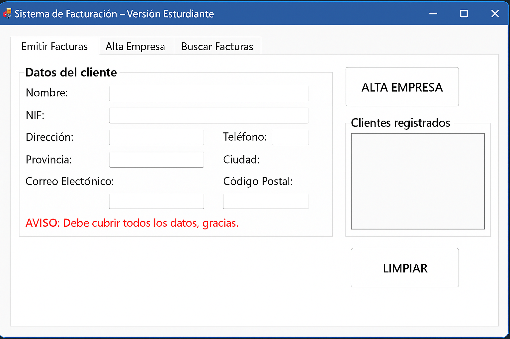

# 💼 Sistema de Facturación – Versión Estudiante

Aplicación de escritorio desarrollada en **C# con Windows Forms y MySQL**, que permite gestionar clientes y emitir facturas automáticamente. Este proyecto fue realizado inicialmente en grupo y luego **refactorizado, rediseñado y mejorado individualmente por mí** como parte de mi portfolio personal.

---

## 🧠 Objetivo del proyecto

- Aprender el ciclo completo de una aplicación de facturación.
- Conectar una base de datos MySQL con C#.
- Generar facturas a partir de plantillas.
- Enviar las facturas por correo electrónico desde la aplicación.
- Practicar buenas prácticas de código, arquitectura y diseño de interfaces.

---

## ✨ Funcionalidades principales

- ✅ Alta de nuevas empresas/clientes con validación de datos.
- ✅ Visualización de clientes registrados.
- ✅ Inserción de facturas en base de datos MySQL.
- ✅ Uso de plantillas RTF para generar facturas.
- ✅ Envío automático por correo electrónico (SMTP Gmail).
- ✅ Diseño visual mejorado y organizado por secciones.
- ✅ Separación entre lógica de interfaz y lógica de negocio.
- ✅ Refactorización con código limpio y seguro (uso de parámetros SQL, variables de entorno, etc.).

---

## 🧩 Tecnologías utilizadas

| Lenguaje / Framework | Descripción                          |
|----------------------|--------------------------------------|
| C#                   | Lenguaje principal                   |
| Windows Forms        | Interfaz gráfica                     |
| MySQL                | Base de datos relacional             |
| SMTP / .NET Mail     | Envío de correos electrónicos        |
| .NET Framework 4.7.2 | Target principal del proyecto        |
| Visual Studio        | Entorno de desarrollo                |

---

## 📸 Capturas del sistema

### Emitir Factura



## ⚙️ Estructura del código

Proyecto_Facturacion/
├── Models/
│ ├── Cliente.cs
│ └── Mes.cs
├── Services/
│ ├── FacturaService.cs
│ └── ClienteService.cs
├── Form1.cs
├── Form1.Designer.cs
├── App.config
└── README.md

## 🚀 Cómo ejecutar el proyecto

1. Clona el repositorio:
   ```bash
   git clone https://github.com/vanessabguijarro/proyectoCSharp.git

2. Abre el archivo .sln en Visual Studio.

3. Asegúrate de tener instalado:

   - .NET Framework 4.7.2 Developer Pack

   - MySQL Server corriendo localmente

4. Modifica la cadena de conexión en App.config:

<connectionStrings>
  <add name="MySqlConexion" connectionString="server=localhost;uid=root;password=TU_CLAVE;database=empresa"/>
</connectionStrings>
     
5. Ejecuta la aplicación con F5 🚀

## 🔐 Seguridad
Este proyecto está preparado para usar variables de entorno en lugar de contraseñas incrustadas en el código (ej: Gmail App Password).
Se recomienda configurarlas antes de probar la función de envío de correos.

## 🧠 Aprendizajes personales
- Durante la refactorización de este proyecto, puse en práctica:

   - Separación de responsabilidades (UI vs lógica).
   
   - Validación estructurada de entradas del usuario.
   
   - Buenas prácticas de manejo de errores.
   
   - Mejora de la experiencia de usuario (UI/UX).
   
   - Uso de recursos externos como plantillas RTF.

## 📃 Licencia
Este proyecto fue realizado con fines educativos y no tiene una licencia comercial. Puedes usarlo como referencia para tus propios desarrollos personales.
